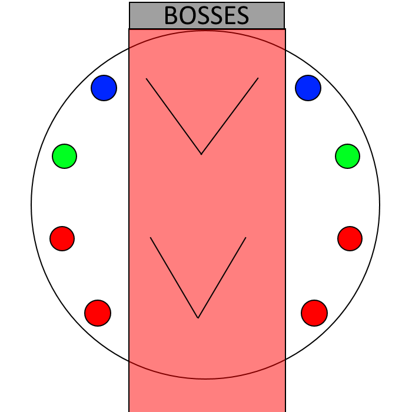

# Semi-Boomer Guide To Recurring Alex Mechanics

With Alex ultimate being confirmed we’re clearly going to be seeing some old mechanics come back, and I’m making this thing not to ask you to learn how to do everything here, but be familiar with what the mechanic actually is, **for the purposes of callouts and learning the fights as they go.**

Some mechanics here will be things we’ve seen before and I’ll do my best to relate it to a newer mechanic from Omega/Eden if the parallels are there.

We know that [Living Liquid](#living-liquid), [Brute Justice](#brute-justice), [Cruise Chaser](#cruise-chaser) and [Alexander Prime](#alexander-prime) are confirmed, so this document will focus almost entirely on them.

## Living Liquid

`NOTE: I am a zoomer who never did A3S legit so this information might be incorrect`

### Protean Wave 

> Alternate Mechanic Names: Flamethrowers in O11S, Slicer in E2S

An initial (telegraphed in A3S) set of pushback cones come out, then damage goes out in a line to each party member originating from the boss; Getting hit by the pushback or stacking 2 of these would deal lethal damage. 

To solve this mechanic, we implement clock positions (These are already common) but with Ultimate the regular clocks are often not good enough. For example, Quickmarch in UCOB has a divebomb going off afterwards so groups generally keep the north and south positions vacant by stacking more tightly in the sides. 

> Diagram is from here: http://clees.me/guides/ucob/

### Digititis

> Alternate Mechanic Names: Allagan Rot in T2, Aether Rot in O7, Judgment Nisi in A4, Healer Vice and Virtue in E1, &c.

A debuff that can be passed to other players by walking over them. In some cases (A4, O7) this mechanic must not drop and be passed among different members until it resolves. These debuffs generally have DoTs associated with them. 

In Living Liquid's case Digititis consists of 3 debuffs which do different things:

* A tank starts with a debuff that increases damage taken
* A healer starts with a debuff that lowers healing potency
* A DPS starts with a debuff that lowers damage dealt. 

To solve this mechanic and general rot/prey/tether mechanics, two rules must be followed:

1. The passing order is known (e.g. T1 T2 D1 D2 on Titania tether)
2. **One** person in the passing pair is **stationary**. 
   * This is an unfortunate side effect of XIV's netcode that we have to deal with, but if both the passer and the receiver are moving, more often than not the game will think that they never touched. 
   * Sometimes, the sender is stationary (Healer V&V), and other times the receiver is stationary (O7S Rot). This will be dealt with on a by-mechanic basis.

### Drainage

> Alternate Mechanic Names: Mustard Bomb in O11S

A tether that can be passed to other players by walking over them or the tether. After the mechanic resolves, big AoE damage is dealt to the tethered player. 

This mechanic is solved in the same exact way as [Digititis](#digititis), but the player taking it must take it away from the rest of the party. 

### Ferrofluid

> Alternate Mechanic Names: I forget what the magnet thing is called in O11S.

A tether between two players (generally between a DPS and non-DPS) which, upon resolving, will pull or push the connected players depending on whether their signs attract ( + - ) or repel ( - - / + + ). 

General advice for this mechanic is stay loosely spread among your group and look only at who you are tethered to.

## Brute Justice
>This will also include mechanics about his boys (who will definitely be a part of his phase) that were a part of A8S.

`NOTE: I am a zoomer who never did A8S legit so this information might be incorrect`

### Brawler - Attachment

Brawler will attach either a drill or a buster on one or both of his arms, doing a different mechanic after the animation resolves.

* Single Buster - Line TB on the tank
* Double Buster - Line TB with Very High Damage on the tank which must be soaked with the party
* Single Drill - Attacks a random player. The damage dealt by this mechanic is based on distance from the boss (You will die at melee range)
* Double Drill - Targets the closest and furthest players from the boss. Two AoEs hit the closest and furthest player, dealing damage and knocking back / stunning anyone else hit by the mechanic.

In reality this mechanic is simple. You hear the callout for the attachment, and you know to do one thing. Double Drill is the hardest one to do but since we're most likely going to be in BJ's arena it can be easily baited with a lot of room to breathe for the rest of the party. 

### Swindler - Enumeration

Enumeration is a stack marker with either 2, 3, or 4 orbs revolving around it. Having more or less players in the stack will deal lethal damage to everyone in the stack.

This mechanic is solved by having a priority system. In A6S, the tanks+healers and DPS grouped up, with each member having a priority (e.g. DRG 1, NIN 2, BRD 3, MCH 4). The number of orbs determines who goes into the stack (e.g. 3 orbs, everyone from 1-3 goes in). 

There can be some confusion here as the stack marker is NOT guaranteed to land on the lowest priority target. In that case, the "numbers" everyone has will just shift accordingly. This is a not-so-easy mechanic and if we have to deal with Enumeration, we will go over it in detail (Ultimate enumeration will probably have 3 stacks lol) 

### Swindler - Height

Players will be assigned Low Arithmeticks (Red Debuff) or High Arithmeticks (Purple Debuff). Platforms in the arena will also be raised and turn red in a checkerboard pattern. Players with Low on a Low platform (and vice versa) will not only die, but kill the rest of the raid by inflicting them with damage down.

Solved by a really simple mnemonic: **Red on red**. If your debuff is red, go on a red tile. Otherwise, don't be on a red tile. Obviously they make this mechanic hard by adding other mechanics (e.g. in A6S they did [Enumeration](#swindler---enumeration) while Height was happening)

### Vortexer - Vortexer

## **We will deal with Vortexer mechanics if we ever have to deal with them.**

### Long Needle

>Similar Mechanics: Pantokrator in O11S, Stormy Horizons in E3S

Random players continually get marked for telegraphed AoE's, one player will be targetted by a Prey marker which deals high damage in a small aoe, and another player will be targetted by a stack marker.

This mechanic is resolved by rotating around the boss, while the person marked with prey stays away from the party. 

### Super Jump

>Similar Mechanics: that part in seiryu ex where he jumps to the furthest person i guess

Brute Justice jumps to the furthest player, which deals damage to them and stuns anyone else hit by the AoE.

To deal with this mechanic we pick someone to bait it and stay away from them. This is made harder by adding mechanics that resolve at the same time as the jump.

### Gavel

## **We Will Deal With Gavel If We Have To**
Memes aside, it's a mechanic vomit phase similar to Exdeath Grand Crosses, or Tsunami 2. These mechanics will be vastly different in their Ultimate variations so I will not go over the Savage variant right now.

### Compressed Water and Waterspout

Blaster/Brute Justice will target someone with compressed water debuff, which after a certain amount of time (40s) will explode, dealing a high amount of damage spread evenly across everyone hit. This also spawns a Waterspout add which cannot be targetted.

The waterspout will knock back and damage anyone who is too close to it, and it will explode and wipe the raid if it does not get resolved in time.

This mechanic is solved in A6S by having party members "freeze" the water with an ice AoE. In A8S it is solved by having the tank face BJ towards the add, where his flamethrower will evaporate the add. 

### Hidden Mines

Mines will show up on the field which deal lethal damage to the raid if not found and triggered.

This mechanic is solved by having a party member walk over the mine to trigger it. Usually there are more than 1 mine, so either that person has to be topped up between mines or 2 people get 2 mines.

## Cruise Chaser

`NOTE: I am a zoomer, therefore I HAVE done A11S.` 

### Larboard / Starboard Laser Sword

> Similar Mechanics: O11S Larboard/Starboard Wave Cannon, E3S Temporary Current, E4S Earthen Fists

Cruise Chaser raises his sword to the left or right, and swipes at that side. Deals lethal damage and is avoidable.

This mechanic is solved by visual cues: If there is no difference in cast names (Temporary Current), look at the boss animation. If there is (Larboard/Starboard), look at the cast name. Thankfully, Cruise Chaser has **Both** an animation and a cast name. 

Probably in Ultimate this mechanic will probably just be called "Laser Sword" and it goes by animation, but this is just speculation.

### Optical Sight

This mechanic has many variants with different tells:

#### Variant #1 - 2 Big Balls on his head

> Similar Mechanics: The part in O11S flamethrowers where you drop the 8 aoe's

This mechanic has two sets of AoEs; The first set covers the entire center of the arena, which forces players to run to the edge. The second set is a telegraphed aoe on every member, which means that they have to be at the edge and they cannot stack.

This mechanic is resolved by having clock positions. Thats It

#### Variant #2 - 6 Small Balls on his head jiggling

> Similar Mechanics: Shiva Circles

Hits two opposite edges (N/S or E/W) and rotates clockwise twice, with a final explosion in the center. Also, a healer and a dps will be targetted with a big yellow marker.

To solve this mechanic, we group the DPS and non-dps together, as they run to opposite sides of the arena.

#### Variant #3 - 6 Small Balls on his head, not jiggling

> Similar Mechanics: The part in E3S where we stack up, drop aoes, and then move to the edge

When this mechanic goes out, random players will have untelegraphed aoes dropped under them. When the AoEs get resolved, the center of the arena also explodes, covering everything but the edge.

To solve this mechanic, we group up in the center, and then run to the edge as a group to avoid all aoes.

### Limit Cut

> "Similar" Mechanics: O12S numbers

Marks players with a number from 1 to 8. In order, Cruise Chaser teleports behind every **odd** numbered player, knocking them back, while he slashes towards every **even** numbered player. Each attack deals a vuln so you will die if you take 2 hits.

As it is a complex mechanic, We Will Talk About This Mechanic When We Get To It

### GA-100

> Similar Mechanics: Flare

It's a flare.

### Eternal Darkness

Arena change which makes it so that players take minor damage from doing any action (Including moving, turning, or casting)

## Alexander Prime

`NOTE: I am a zoomer, therefore I HAVE done A12S.` 

### Sacrament / Radiant Sacrament

A variable-cast mechanic where Alex Prime either has a safe spot under him (Radiant) or to his corners (Sacrament)

It's a deal of watching the cast bar

### Gravitational Anomaly

A set pattern of expanding circles appear on the ground while party members also drop identical circles.

To deal with this mechanic, first be aware of the set pattern, found either in A12 or in The Twinning's final boss (The Center Is Always Safe). In A12, if no circles are baited in the center, The Center Is Always Safe.

### Temporal Stasis

## **We Will Deal With Time Stop If We Have To**

Memes aside, it's a mechanic vomit phase similar to Exdeath Grand Crosses, or Tsunami 2. These mechanics will be vastly different in their Ultimate variations so I will not go over the Savage variant right now.

### Timegates and Judgement Crystals

This mechanic is split into two, as half the party will stay outside and the other half will stay inside.

#### Timegates

Four time gates will spawn on the corners of the arena, and a time limit starts before Alex erases us in the past. The first player to each gate will be sent to the past where they must defeat an add - Two wings which deal moderate damage, one Might which will constantly cast tankbusters, and one Time will deal percentage HP based damage. Obviously we bring in DPS, Tank, and Healer to deal with the adds respectively. 

Side note it's a personal DPS check which I absolutely love

#### Judgement Crystals

The players staying outside will be marked one at a time for placing a crystal. These crystals explode, dealing proximity-based damage when they are too close to each other, or when Alex is too close to any of them. We place these on the cardinal directions for a [later mechanic](#inception)... 

### Inception

Alexander will become invisible and teleport to one of the 8 cardinal edges of the map. Immediately after he shows up, he casts Sacrament. We placed the crystals on the cardinals as a measure for where Alex will teleport when he's invisible. 

### Void of Repentance

Alex will channel himself in the background, and Alexander Prime Maximum starts interacting with the next few mechanics:

#### Communion

Alex Maximum targets all DPS players with tethers, dropping puddles where they stand 6 times. Stepping on these puddles will inflict a lethal bleed.

During this time two large circles also show up, whose "hp" and size lower whenever a player walks on top of them. Every circle soak deals single target damage and applies a vuln. This must be soaked 3 times by 3 different players or else lethal raidwide damage is dealt.

Alex also has a tank buster during this time and the phase ends with a stack marker on a healer which requires at least 4 people to be stacked. Also he casts Sacrament because why not. Also in the middle of this Alex maximum casts a raidwide that can't be mitigated by debuffs because why not.

Resolving this mechanic is simple -- in theory. A few things must be resolved.

1. The void circles must be soaked 3 times by 3 different party members. 
    * This is going to be a melee, a ranged, and a tank respectively.
2. The Alex Maximum AoE and tank buster must be properly mitigated
3. The stack marker at the end must be resolved with 2 healers and 2 dps without magic vuln
   * This is resolved by having the first soak (the melees) bait their circles towards the healers as they go on. 

Sounds easy right? I wouldn't sweat it too much because this mechanic will probably go through some changes in Ultimate.

For the brave: [link](http://i2.wp.com/clees.me/home/wp-content/uploads/2017/06/communion.png?w=835)